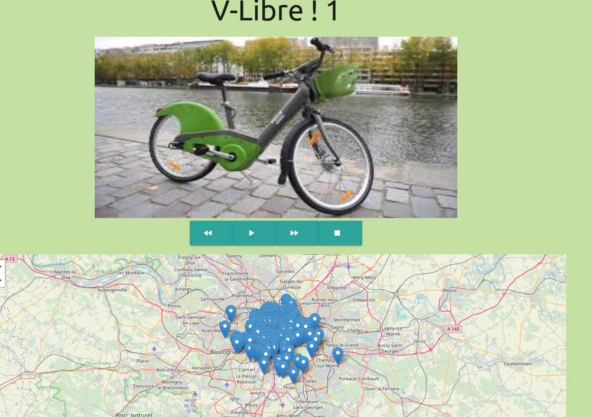

## React Velib Application 
This project was bootstrapped with [Create React App](https://github.com/facebook/create-react-app).
#### Learning React I create this project, the purpose of this application is to be able to book a [Velib](https://www.velib-metropole.fr/) for 20 minutes.
#### Functionnalities :

* As a User I can see a diaporama
* As a User I can play, run, stop, go to the next or previous image of a diaporama
* I can see a Map with the avaibles bikes in stations
* When I Hover on a station I can see the name
* When I click on a station a Form is opened to book the bike
* I can book a bike for 20 minutes
* If a bike is booked the reservation is saved for 20 minutes even if I refresh the page

#### Data comes from [Open data Paris](https://opendata.paris.fr/)

